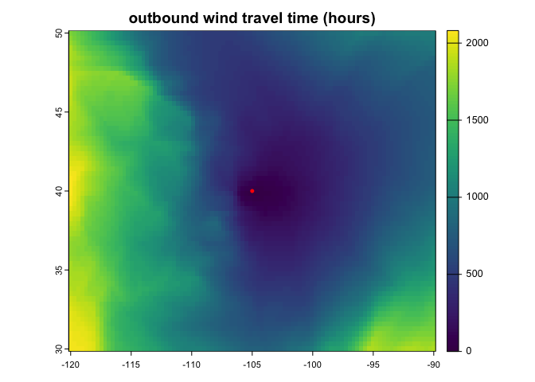

windscape: time-integrated wind dispersal modeling in R
================


The `windscape` R package models landscape connectivity by wind
dispersal. It includes functions to help you import wind data, model
wind diffusion times across a region, visualize the results, and test
statistical relationships between wind and your ecological data.

### Installation

`devtools::install_github("matthewkling/windscape")`

### Usage

Here’s a demonstration of a workflow to create a map of estimated wind
travel times from a particular location. See the package vignette for
details and other functionality.

``` r
library(windscape)
```

    ## Loading required package: gdistance

    ## Loading required package: raster

    ## Warning: package 'raster' was built under R version 4.3.1

    ## Loading required package: sp

    ## Warning: package 'sp' was built under R version 4.3.1

    ## Loading required package: igraph

    ## Warning: package 'igraph' was built under R version 4.3.1

    ## 
    ## Attaching package: 'igraph'

    ## The following object is masked from 'package:raster':
    ## 
    ##     union

    ## The following objects are masked from 'package:stats':
    ## 
    ##     decompose, spectrum

    ## The following object is masked from 'package:base':
    ## 
    ##     union

    ## Loading required package: Matrix

    ## 
    ## Attaching package: 'gdistance'

    ## The following object is masked from 'package:igraph':
    ## 
    ##     normalize

    ## Loading required package: terra

    ## Warning: package 'terra' was built under R version 4.3.3

    ## terra 1.7.78

    ## 
    ## Attaching package: 'terra'

    ## The following objects are masked from 'package:igraph':
    ## 
    ##     blocks, compare

    ## 
    ## Attaching package: 'windscape'

    ## The following object is masked from 'package:terra':
    ## 
    ##     direction

    ## The following object is masked from 'package:gdistance':
    ## 
    ##     geoCorrection

    ## The following object is masked from 'package:igraph':
    ## 
    ##     random_walk

    ## The following object is masked from 'package:raster':
    ## 
    ##     direction

``` r
library(tidyverse)
```

    ## Warning: package 'ggplot2' was built under R version 4.3.1

    ## ── Attaching core tidyverse packages ──────────────────────── tidyverse 2.0.0 ──
    ## ✔ dplyr     1.1.2     ✔ readr     2.1.4
    ## ✔ forcats   1.0.0     ✔ stringr   1.5.0
    ## ✔ ggplot2   3.5.0     ✔ tibble    3.2.1
    ## ✔ lubridate 1.9.2     ✔ tidyr     1.3.0
    ## ✔ purrr     1.0.1

    ## ── Conflicts ────────────────────────────────────────── tidyverse_conflicts() ──
    ## ✖ lubridate::%--%()      masks igraph::%--%()
    ## ✖ dplyr::as_data_frame() masks tibble::as_data_frame(), igraph::as_data_frame()
    ## ✖ purrr::compose()       masks igraph::compose()
    ## ✖ tidyr::crossing()      masks igraph::crossing()
    ## ✖ tidyr::expand()        masks Matrix::expand()
    ## ✖ tidyr::extract()       masks terra::extract(), raster::extract()
    ## ✖ dplyr::filter()        masks stats::filter()
    ## ✖ dplyr::lag()           masks stats::lag()
    ## ✖ tidyr::pack()          masks Matrix::pack()
    ## ✖ dplyr::select()        masks raster::select()
    ## ✖ purrr::simplify()      masks igraph::simplify()
    ## ✖ tidyr::unpack()        masks Matrix::unpack()
    ## ℹ Use the conflicted package (<http://conflicted.r-lib.org/>) to force all conflicts to become errors

``` r
site <- vect(matrix(c(-105, 40), 1)) # 

rast(system.file("extdata/wind.tif", package = "windscape")) %>% # load wind time series rasters
      wind_field(order = "uuvv") %>% # convert to a formal wind field object
      wind_rose() %>% # summarize into wind rose conductance object
      wind_graph("downwind") %>% # format as connectivity graph
      least_cost_surface(site) %>% # calculate least cost path from coordinates
      plot(main = "outbound wind travel time (hours)") # plot map of travel times

points(site, col = "red") # add origin location to map
```

<!-- -->

<!-- ### In the wild -->
<!-- Publications that have used the `windscape` framework include: -->
<!-- -   **Kling, M.**, and D. Ackerly. (2021) Global wind patterns shape genetic differentiation, asymmetric gene flow, and genetic diversity in trees. Proceedings of the National Academy of Sciences, 118(17) [<https://doi.org/10.1073/pnas.2017317118>] -->
<!-- -   **Kling, M.**, and D. Ackerly. (2020) Global wind patterns and the vulnerability of wind-dispersed species to climate change. Nature Climate Change, 10: 868-875 [<https://doi.org/10.1038/s41558-020-0848-3>] -->
