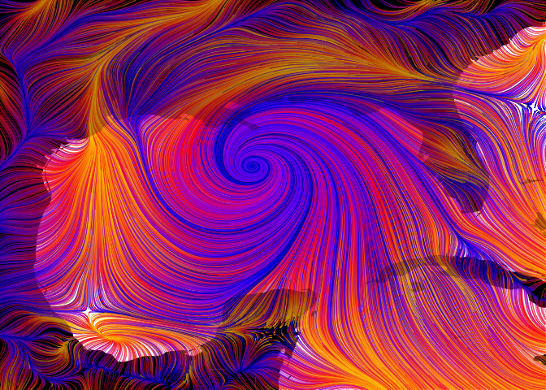
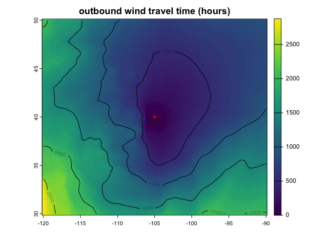

windscape: model wind-borne landscape connectivity
================

The `windscape` R package models landscape connectivity by wind
dispersal. It includes functions to help you download wind data, model
wind diffusion times across a region, visualize the results, and test
statistical relationships between wind and your ecological data.

### Installation

`devtools::install_github("matthewkling/windscape")`

### Usage

Here’s how to download wind data for a particular place and time (the
Gulf of Mexico during Hurricane Katrina, in this case) from the Climate
Forecast System Reanalysis, simulate the flow of wind-borne particles,
and visualize the results as a map:

``` r
library(windscape)
library(tidyverse)

w <- cfsr_dl(years = 2005, months = 8, days = 28, hlim = c(23, 23), # request CFSR data for 28 Aug 2005, 11 pm UTC
             xlim = c(-99, -78) + 360, ylim = c(17, 35)) %>% # spatial bounding box for which to get data
      shift(dx = -360) %>% # shift longitudes from CFSR's [0:360] range to standard [-180:180] range
      wind_field() # format as a wind_field object

f <- particle_flow(w, p = 9000, n_iter = 200, scale = .005, direction = "both") # generate particle trails

md <- map_data("world") # get reference data used to plot land masses

ggplot() + # make map
      geom_polygon(data = md, aes(long, lat, group = group), fill = "black") +
      geom_path(data = f, aes(x, y, group = g, color = t), linewidth = .25) +
      geom_polygon(data = md, aes(long, lat, group = group), fill = "black", color = NA, alpha = .25) +
      coord_cartesian(xlim = ext(w)[1:2], ylim = ext(w)[3:4], expand = F) +
      scale_color_gradientn(colors = c("gold", "orange", "red", "purple", "blue", "darkblue")) +
      theme_void() +
      theme(legend.position = "none")
```

<!-- -->

As a second example, here’s how to use a longer-term time series of wind
data to calculate estimated wind travel times from a particular
location. These wind travel times can be used to make a map as done
here, or analyze relationships between wind and ecological patterns as
demonstrated in the package vignette:

``` r
site <- vect(matrix(c(-105, 40), 1)) # lat-lon coordinates of a focal site

lc <- rast(system.file("extdata/cfsr_usa.tif", package = "windscape")) %>% # load wind time series rasters
      wind_series(order = "uuvv") %>% # convert to a formal wind field time series object
      wind_rose() %>% # summarize into wind rose conductance object
      wind_graph("downwind") %>% # format as connectivity graph
      least_cost_surface(site) # calculate least cost path from coordinates

plot(lc, main = "outbound wind travel time (hours)") # plot map of travel times
contour(lc, add = TRUE)
points(site, col = "red") # add origin location to map
```

<!-- -->

<!-- ### In the wild -->
<!-- Publications that have used the `windscape` framework include: -->
<!-- -   **Kling, M.**, and D. Ackerly. (2021) Global wind patterns shape genetic differentiation, asymmetric gene flow, and genetic diversity in trees. Proceedings of the National Academy of Sciences, 118(17) [<https://doi.org/10.1073/pnas.2017317118>] -->
<!-- -   **Kling, M.**, and D. Ackerly. (2020) Global wind patterns and the vulnerability of wind-dispersed species to climate change. Nature Climate Change, 10: 868-875 [<https://doi.org/10.1038/s41558-020-0848-3>] -->
