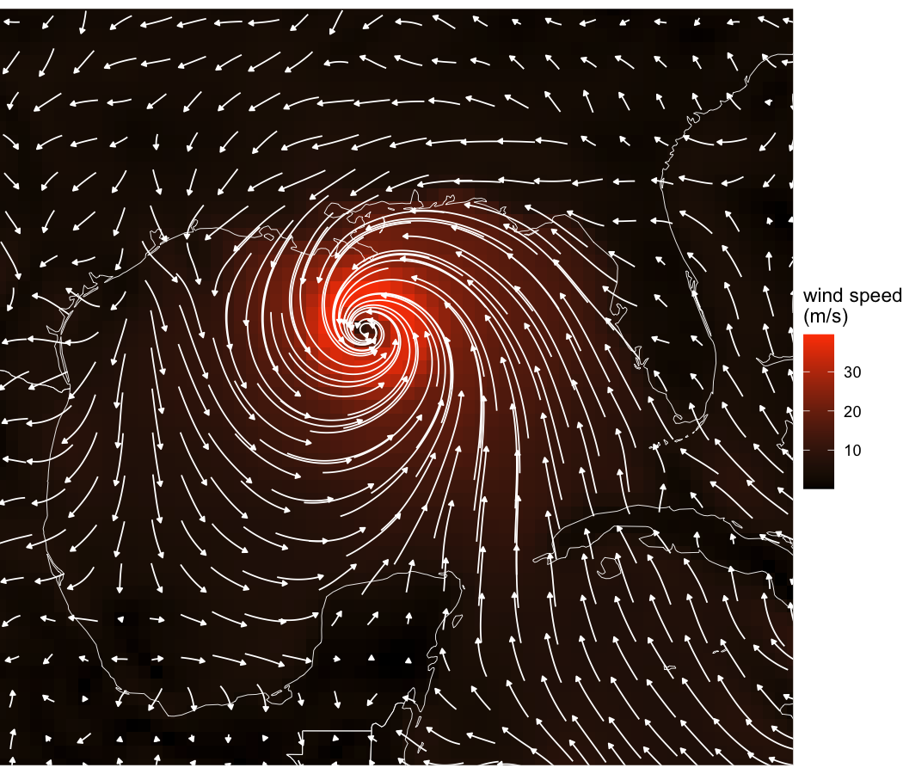
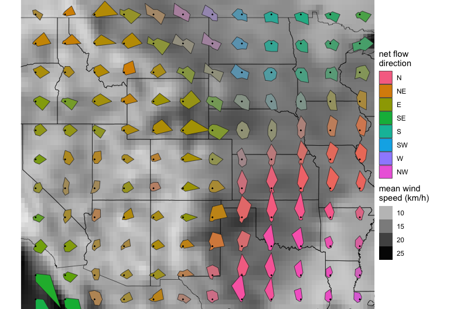
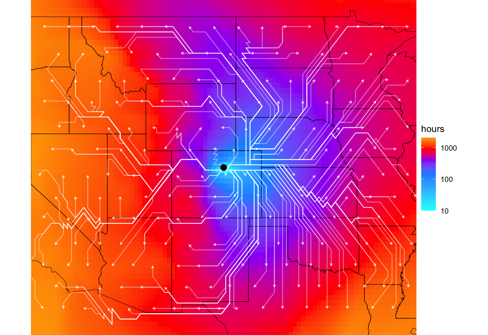
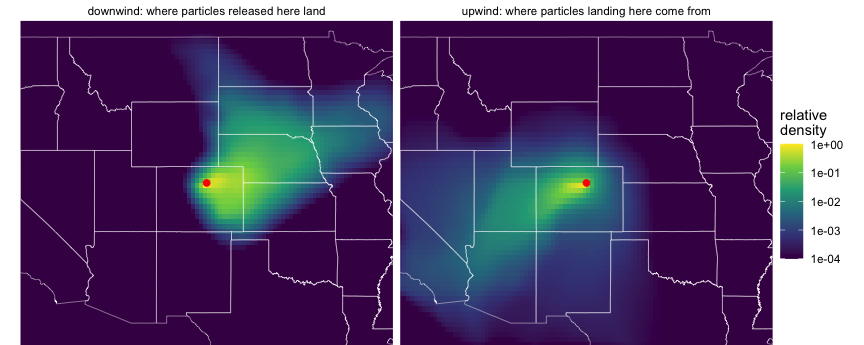

# windscape

<!-- badges: start -->

<!-- badges: end -->

Because wind is a major dispersal vector for particles ranging from
pollen, seeds, and spores to insects, pathogens, and pollutants, wind
regimes shape many geographic patterns in ecology. But the variation in
wind strength and direction over space and time makes it challenging to
study wind’s role in landscape connectivity. The **windscape** package
provides a toolset for modeling the effects of time-integrated wind
regimes in spatial ecology, landscape genetics, and related fields. Use
it to:

- **download** and summarize wind data in the form of raster time series
- **model windsheds** representing a site’s upwind catchment and
  downwind deposition shadow, which often differ substantially
- **model pairwise connectivity** among sets of sites to generate
  asymmetric matrices of directional wind connectivity between site
  pairs using either *least cost path* or *random walk* approaches
- **test statistical hypotheses** about spatial relationships between
  wind and ecological outcomes
- **visualize** spatial wind patterns—including instantaneous wind
  fields, time-integrated wind regimes, and windsheds—in ggplot2

While **windscape** can be used to map air flow patterns at a single
moment, its core connectivity models summarize long time series of wind
data into wind regimes, describing the expected connectivity averaged
over many dispersal events. It is thus designed for analyzing processes
that accumulate over time, such as gene flow, colonization, and range
expansion.

## Installation

Install the development version from GitHub:

``` r
# install.packages("remotes")
remotes::install_github("matthewkling/windscape")
```

## Overview

| Task | Functions |
|:---|:---|
| Get wind data | `ncar_download()`, `ncar_land()`, `read_wind_series()`, `windscape_example()` |
| Summarize a wind regime | `wind_rose()`, `combine_roses()`, `weight_conductance()`, `downscale()` |
| Map windsheds | `least_cost_surface()`, `least_cost_paths()`, `random_walk()`, `ws_summarize()` |
| Connectivity among sites | `pairwise_least_cost()`, `pairwise_random_walk()`, `check_cell_distance()` |
| Test hypotheses | `pairwise_ratios()`, `pairwise_means()`, `mantel_test()` |
| Trace airflow | `wind_trails()` |
| Visualize | `geom_wind_rose()`, `geom_wind_arrow()`, `geom_wind_trail()`, `geom_wind_path()`, `scale_fill_bearing()` |

## Get wind data

`ncar_download()` downloads hourly wind data from NCAR’s Geoscience Data
Exchange, with no account needed. Datasets include ERA5 (1940 to
present), CFSR (1979-2010), and CFSv2 (2011 to present). Data are
clipped to your region on the server and saved as one file per month.

``` r
library(windscape)

# a decade of 10 m altitude ERA5 winds for the western and central US, every 3rd hour
files <- ncar_download("era5", xlim = c(-120, -90), ylim = c(30, 50),
                       years = 2011:2020, time_stride = 3, dir = "~/wind_data")
```

### Visualize wind fields

A `wind_field` is a pair of rasters representing the wind conditions
across a landscape at a single moment. Most **windscape** modeling
analyses involve summarizing many wind fields, but we can also visualize
an individual field using `geom_wind_arrow()` to draw wind vectors, or
`geom_wind_trail()` to draw trails that follow the airflow, here for
Hurricane Katrina on August 28, 2005. (`wind_trails()` returns the same
trails as data.)

``` r
library(windscape)
library(ggplot2)

katrina <- windscape_example("wind_field")
world <- map_data("world")

ggplot(katrina, aes(x, y)) +
      geom_raster(aes(fill = speed)) +
      geom_path(data = world, aes(long, lat, group = group), color = "white", linewidth = 0.2) +
      stat_wind_trail(color = "white", hours = 6, steps = 100) +
      scale_fill_gradientn(name = "wind speed\n(m/s)", colors = c("black", "orangered")) +
      coord_quickmap(xlim = c(-99, -78), ylim = c(17, 35), expand = FALSE) +
      theme_void()
```



### Summarize wind regimes

A **wind rose** summarizes a time series of wind fields into a model of
the wind regime: for each grid cell, the average conductance of wind
toward each of its eight neighbors. `wind_rose()` can build one from a
set of files a month at a time, so long records needn’t fit in memory.
The `trans` argument sets how wind speed translates into conductance so
the rose reflects the winds that matter for dispersal, for example to
model propagules that are only released in strong winds.

``` r
rose <- wind_rose(files, trans = 1)
```

The examples below use a small `wind_rose` object that ships with the
package, built from the same region as the data downloaded above.
`geom_wind_rose()` maps it as a field of glyphs, each showing the
distribution of flow directions in a block of cells, colored by the
direction of net flow:

``` r
rose <- windscape_example("wind_rose")
states <- map_data("state")

ggplot(rose, aes(x, y)) +
    geom_raster(aes(alpha = speed), fill = "black") +
    geom_path(data = states, aes(long, lat, group = group), color = "black", linewidth = 0.2) +
    geom_wind_rose(res = 12, scale = 1.5) +
    coord_quickmap(xlim = ext(rose)[1:2], ylim = ext(rose)[3:4], expand = FALSE) +
    theme_void() +
    labs(alpha = "mean wind\nspeed (km/h)")
```



## Map windsheds

By analogy to watersheds, “windsheds” are the upwind catchment area
where particles arriving at a site originate, or the downwind deposition
area where particles released from the site end up. These two surfaces
represent how wind connects a site to the surrounding landscape, and
typically differ strongly from each other due to the directionality of
wind patterns. windscape offers two complementary ways to model this
connectivity, both of which use a `wind_rose` as input.

### Least-cost paths

Least-cost path models find the fastest route between places, giving
wind travel times in hours of effective wind transport along the best
route under the long-run wind regime. `least_cost_surface()` maps travel
time from a site, and `least_cost_paths()` traces a set of individual
routes. Here we use them together to model *downwind* connectivity from
a site in the center of the landscape.

``` r
site <- cbind(-105, 40)
destinations <- generate_particles(rose, 500, "grid")

graph <- wind_graph(rose, direction = "downwind")
hours <- least_cost_surface(graph, site)
paths <- least_cost_paths(graph, site, destinations)

ggplot(as.data.frame(hours, xy = TRUE), aes(x, y)) +
      geom_raster(aes(fill = pmax(hours, 10))) + # floor at 10 hours for the log scale
      geom_path(data = states, aes(long, lat, group = group), color = "black", linewidth = 0.2) +
      geom_wind_path(data = paths, alpha = .5, color = "white") +
      annotate("point", site[1], site[2], color = "black", size = 3) +
      scale_fill_gradientn(name = "hours", trans = "log10", values = c(0, .5, .7, .85, 1),
                           colors = c("cyan", "dodgerblue", "purple", "red", "orange")) +
      coord_quickmap(xlim = c(-120, -90), ylim = c(30, 50), expand = FALSE) +
      theme_void()
```



### Random walks

Random walk models instead simulate particles diffusing through the wind
regime, optionally with deposition at a rate set by a half-life. They
capture dispersal along all routes, not just the fastest one. Here we
use `random_walk()` to compare the downwind and upwind windsheds of the
same site:

``` r
down <- random_walk(rose, site, mode = "stream", direction = "downwind", half_life = 100)
up <- random_walk(rose, site, mode = "stream", direction = "upwind", half_life = 100)

d <- rbind(data.frame(fortify(down)[c("x", "y")], value = fortify(down)$deposition,
                      windshed = "downwind: where particles released here land"),
           data.frame(fortify(up)[c("x", "y")], value = fortify(up)$origin,
                      windshed = "upwind: where particles landing here come from"))
d$value <- d$value / ave(d$value, d$windshed, FUN = max) # relative to each windshed's peak

ggplot(d, aes(x, y)) +
      geom_raster(aes(fill = value)) +
      geom_path(data = states, aes(long, lat, group = group), color = "white", linewidth = 0.15) +
      annotate("point", site[1], site[2], color = "red", size = 2) +
      facet_wrap(~windshed) +
      scale_fill_viridis_c(name = "relative\ndensity", trans = "log10",
                           limits = c(1e-4, 1), oob = scales::squish) +
      coord_quickmap(xlim = c(-120, -90), ylim = c(30, 50), expand = FALSE) +
      theme_void() +
      theme(strip.text = element_text(margin = margin(4, 0, 4, 0)))
```



For comparing windsheds among many sites, `ws_summarize()` computes a
windshed’s summary statistics such as its size, its centroid, and how
concentrated it is in a few compass directions.

## Estimate connectivity among sites

Many studies require pairwise connectivity estimates among a set of
sites, such as sampled populations. `pairwise_least_cost()` and
`pairwise_random_walk()` return matrices of wind connectivity between
every pair of sites. Wind connectivity is directional, so these matrices
are asymmetric: element `[i, j]` describes flow from site `i` to site
`j`. The least-cost model uses each site’s exact location, even for
sites within the same grid cell, while the random walk model treats each
site as the grid cell it falls in; `check_cell_distance()` reports how
much that distorts distances among closely spaced sites.

``` r
sites <- cbind(lon = c(-110, -105, -100, -95), lat = c(40, 42, 38, 44))

pairwise_least_cost(graph, sites) |> round() # travel time, in hours
```

    ##      [,1] [,2] [,3] [,4]
    ## [1,]    0  121  379  568
    ## [2,]  824    0  277  459
    ## [3,] 1081  362    0  309
    ## [4,] 1221  538  503    0

``` r
pairwise_random_walk(rose, sites, half_life = 100) |> signif(2) # deposition density
```

    ##         [,1]    [,2]    [,3]    [,4]
    ## [1,] 3.6e-05 1.3e-06 2.4e-08 6.6e-08
    ## [2,] 1.3e-14 1.4e-05 3.1e-08 1.5e-07
    ## [3,] 1.5e-15 7.5e-10 1.9e-05 3.1e-07
    ## [4,] 4.2e-18 7.1e-11 1.5e-10 2.3e-05

These matrices can be compared with ecological data, such as genetic
differentiation or gene flow, to test whether wind shapes ecological
patterns. `pairwise_means()` and `pairwise_ratios()` derive matrices for
testing hypotheses about the strength and the directionality of wind
connectivity, and `mantel_test()` tests their relationships with other
pairwise data. The package includes `birch`, a landscape genetic data
set for silver birch, for trying these out.
