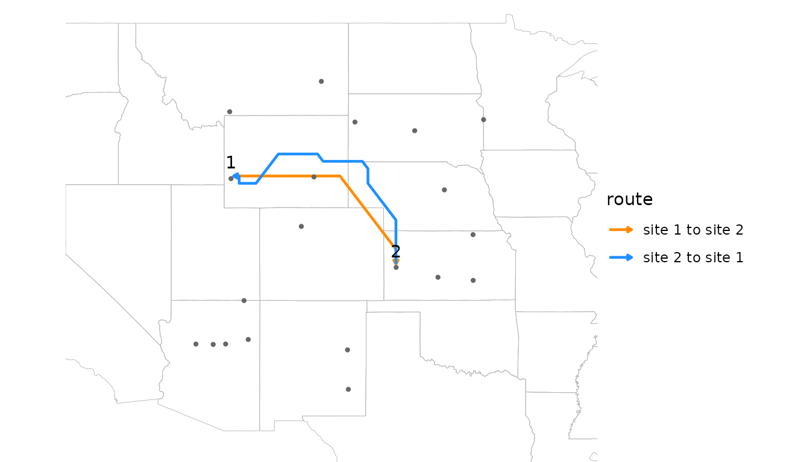
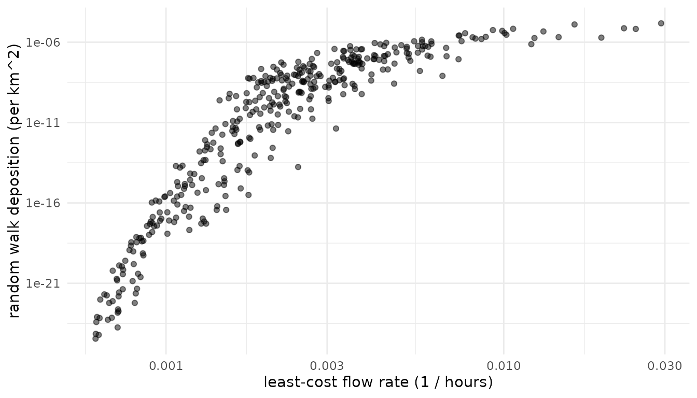

# Pairwise connectivity

Many ecological questions about wind concern a set of sites rather than
a single one. Does wind explain gene flow or genetic differentiation
among populations? Do pathogens or pests spread along the routes wind
favors? Are communities more similar where wind links them strongly?
Each of these compares a pairwise matrix of wind connectivity among
sites with a pairwise matrix of ecological data.

This article covers estimating pairwise wind connectivity with
windscape’s two connectivity models, placing sites on the wind grid, and
testing hypotheses about the role of wind with Mantel tests. It uses
model settings such as `half_life` without explaining them in depth; the
[connectivity
models](https://matthewkling.github.io/windscape/articles/connectivity-models.md)
article covers how the models work and how to choose their settings. It
ends with a worked example using `birch`, a landscape genetic data set
that ships with the package.

``` r

library(windscape)
library(ggplot2)

rose <- windscape_example("wind_rose")

states <- map_data("state")
borders <- geom_path(data = states, aes(long, lat, group = group),
                     color = "gray70", linewidth = 0.15, inherit.aes = FALSE)
us <- coord_quickmap(xlim = c(-120, -90), ylim = c(30, 50), expand = FALSE)
```

We’ll use twenty random sites across the example rose’s domain:

``` r

set.seed(2)
sites <- cbind(lon = runif(20, -114, -96), lat = runif(20, 33, 47))
```

## Least-cost connectivity

[`pairwise_least_cost()`](https://matthewkling.github.io/windscape/reference/pairwise_least_cost.md)
returns a matrix of least-cost wind travel times between every pair of
sites, in hours (for a rose built with `trans = 1` from winds in m/s):

``` r

hours <- pairwise_least_cost(rose, sites)
round(hours[1:5, 1:5])
#>      [,1] [,2] [,3] [,4] [,5]
#> [1,]    0  287  184  807  526
#> [2,] 1063    0  312 1178  330
#> [3,]  879  307    0 1342  467
#> [4,]  605  285  521    0  480
#> [5,] 1221  364  394 1498    0
```

Element `[i, j]` is the travel time from site `i` to site `j`, so row
`i` describes travel downwind from site `i`, and column `j` describes
travel upwind to site `j`. That’s why, unlike
[`least_cost()`](https://matthewkling.github.io/windscape/reference/least_cost.md),
this function has no `direction` argument: the matrix covers both.
Because wind is directional, the matrix is asymmetric. Wind takes about
287 hours to carry material from site 1, in southwestern Wyoming, to
site 2, in Kansas, but about 1063 hours to carry it back.
[`least_cost_paths()`](https://matthewkling.github.io/windscape/reference/least_cost_paths.md)
shows the two routes:

``` r

routes <- rbind(data.frame(least_cost_paths(rose, sites[1, , drop = FALSE], sites[2, , drop = FALSE]),
                           route = "site 1 to site 2"),
                data.frame(least_cost_paths(rose, sites[2, , drop = FALSE], sites[1, , drop = FALSE]),
                           route = "site 2 to site 1"))
routes$trail <- as.integer(factor(routes$route))

ggplot(routes, aes(x, y)) +
      borders +
      geom_wind_path(aes(color = route), linewidth = 0.8) +
      annotate("point", sites[, 1], sites[, 2], size = 0.8, color = "gray40") +
      annotate("text", sites[1:2, 1], sites[1:2, 2], label = 1:2, vjust = -0.8) +
      scale_color_manual(values = c("darkorange", "dodgerblue")) +
      us + theme_void()
```



Travel times are a measure of accessibility, small for well-connected
pairs. `rate = TRUE` returns their inverse, a flow rate, which is large
for well-connected pairs, matching the orientation of random walk
connectivity.

## Random walk connectivity

[`pairwise_random_walk()`](https://matthewkling.github.io/windscape/reference/pairwise_random_walk.md)
estimates connectivity with a stream-mode random walk released from each
site in turn. By default, element `[i, j]` is the probability density
(per km^2) that a particle released at site `i` is deposited at site
`j`:

``` r

deposition <- pairwise_random_walk(rose, sites, half_life = 48)
signif(deposition[1:5, 1:5], 2)
#>         [,1]    [,2]    [,3]    [,4]    [,5]
#> [1,] 5.1e-05 5.9e-08 1.1e-06 4.3e-16 3.6e-11
#> [2,] 3.9e-18 4.7e-05 2.3e-08 4.1e-19 1.5e-09
#> [3,] 1.1e-15 2.2e-08 5.9e-05 3.7e-21 3.2e-11
#> [4,] 1.7e-11 5.7e-07 3.0e-09 6.2e-05 1.3e-10
#> [5,] 3.6e-19 3.4e-09 4.0e-09 1.8e-22 3.4e-05
```

A half-life is required under the default `value = "deposition"`, since
without it nothing is deposited. `value = "residence"` instead gives the
time particles from site `i` spend airborne over site `j`, which works
without a half-life. Values are per km^2 of the destination’s grid cell
(`density = TRUE`), because a larger cell catches more of the particles
passing over it; on a longitude/latitude grid, cell area shrinks toward
the poles, so per-cell values would favor low-latitude destinations.

The diagonal holds each site’s self-connectivity: its own release
deposited in its own cell. It’s usually far larger than the other
values, and the tests below ignore it.

Deposition spans many orders of magnitude, from relatively large values
for close downwind neighbors to vanishingly small ones for distant
upwind neighbors, so it’s usually analyzed on a log scale.

## Comparing the models

The two models measure different things: the speed of the best route,
versus the share of material that arrives along all routes, net of
deposition on the way. Plotting one against the other shows how they
relate for these sites:

``` r

off <- row(hours) != col(hours) # pairs of distinct sites
d <- data.frame(rate = 1 / hours[off], deposition = deposition[off])

ggplot(d, aes(rate, deposition)) +
      geom_point(alpha = 0.5) +
      scale_x_log10() + scale_y_log10() +
      labs(x = "least-cost flow rate (1 / hours)", y = "random walk deposition (per km^2)") +
      theme_minimal()
```



``` r


cor(d$rate, d$deposition, method = "spearman")
#> [1] 0.9456101
```

The models largely agree on which pairs are well connected, but not on
how connectivity scales. Among poorly connected pairs, random walk
connectivity falls off far faster than flow rate, so it concentrates on
near, downwind neighbors. Reaching a distant upwind site requires
material to spread against or across the prevailing wind, which becomes
exponentially unlikely with distance, while a least-cost route can
always wait out the wind. Deposition along the way adds to this, but
only modestly: a longer half-life flattens the curve only slightly. The
models also diverge where the fastest route is narrow or roundabout, so
that little material actually follows it.

Least-cost connectivity suits questions about accessibility, and handles
sites that are close together (see below). Random walk connectivity
suits questions about how much material is exchanged, such as dispersal
or gene flow, especially when deposition along the way matters. Where
the choice isn’t clear, testing both is informative.

## Placing sites on the grid

Both models work on the wind rose’s grid, but they place sites on it
differently, which matters when sites are only a few grid cells apart.

[`pairwise_least_cost()`](https://matthewkling.github.io/windscape/reference/pairwise_least_cost.md)
places sites at their actual locations. It adds each site to the wind
graph as a node of its own, linked to the centers of nearby grid cells,
and to other nearby sites, by travel times computed exactly for the
local wind. It therefore distinguishes sites that are close together,
even within the same grid cell. With `snap = TRUE`, sites are instead
moved to the centers of their cells, as in other least-cost tools. Here
are three sites, the first two in the same grid cell:

``` r

near <- cbind(c(-104.95, -104.75, -104.3), c(40.1, 40.25, 40.15))
terra::cellFromXY(rose, near)
#> [1] 3025 3025 3027

round(pairwise_least_cost(rose, near), 1)
#>      [,1] [,2] [,3]
#> [1,]  0.0 16.0 19.6
#> [2,] 27.8  0.0 17.9
#> [3,] 86.6 71.5  0.0
round(pairwise_least_cost(rose, near, snap = TRUE), 1)
#>      [,1] [,2] [,3]
#> [1,]  0.0  0.0 14.9
#> [2,]  0.0  0.0 14.9
#> [3,] 88.7 88.7  0.0
```

Snapped, the first two sites are zero hours apart, with identical travel
times to and from the third site. Placed at their actual locations, they
get distinct travel times, which change smoothly as sites move.

A random walk moves particles from cell to cell, so
[`pairwise_random_walk()`](https://matthewkling.github.io/windscape/reference/pairwise_random_walk.md)
treats each site as its grid cell: sites in the same cell get identical
rows and columns, and the distances and directions among sites a few
cells apart are distorted.
[`check_cell_distance()`](https://matthewkling.github.io/windscape/reference/check_cell_distance.md)
reports how much the grid distorts the distances among a set of sites:

``` r

check_cell_distance(rose, sites)
#> Total point pairs: 190
#> Point pairs in the same grid cell: 0 (0%)
#> Distribution of cell-point distance discrepancies:
#>  0--1%: 90 (47.4%)
#>  1--2.5%: 66 (34.7%)
#>  2.5--5%: 21 (11.1%)
#>  5--10%: 10 (5.26%)
#>  10--25%: 2 (1.05%)
#>  25--Inf%: 1 (0.526%)
```

None of the twenty sites share a cell, and most discrepancies are a few
percent, so this grid suits them. Where many pairs are affected, a finer
grid separates nearby sites, from finer wind data or from
[`downscale()`](https://matthewkling.github.io/windscape/reference/downscale.md),
which interpolates a wind rose onto a finer grid. But a random walk’s
spread depends on cell size, so a finer grid also changes the model: in
one test, downscaling by a factor of 4 narrowed a walk’s spread by 30 to
50 percent. Choose one resolution for an analysis and treat it as part
of the model specification; see
[`?downscale`](https://matthewkling.github.io/windscape/reference/downscale.md).

## Testing hypotheses

Pairwise wind connectivity can be compared with pairwise ecological data
to test whether wind shapes ecological patterns. Kling and Ackerly
(2021) framed several kinds of hypotheses, each using a different
summary of the connectivity matrix:

- **Flow**: is directional wind connectivity related to directional
  ecological flow, such as gene flow or the spread of a pathogen?
  Compare the asymmetric matrices directly.
- **Isolation**: are pairs of sites that are poorly connected by wind,
  in both directions, more different, for example genetically?
  [`pairwise_means()`](https://matthewkling.github.io/windscape/reference/pairwise_means.md)
  averages the two directions into a symmetric matrix of overall
  connectivity, isolating the effects *strength*.
- **Asymmetry**: are directional imbalances in wind connectivity related
  to imbalances in ecological flow?
  [`pairwise_ratios()`](https://matthewkling.github.io/windscape/reference/pairwise_ratios.md)
  converts a matrix into log ratios of the two directions,
  `log(x[i, j] / x[j, i])`, isolating the effects of *direction*.

[`pairwise_ratios()`](https://matthewkling.github.io/windscape/reference/pairwise_ratios.md)
also accepts a vector of site attributes, returning the log ratio of
each pair’s values. This supports site-level hypotheses such as whether
sites that receive more wind than they send, being downwind of the
others, have higher genetic diversity (see the worked example below).

### Mantel tests

The values in a pairwise matrix aren’t independent, since each site
contributes to many pairs, so ordinary correlation tests overstate
significance.
[`mantel_test()`](https://matthewkling.github.io/windscape/reference/mantel_test.md)
assesses significance by permuting sites, rearranging the rows and
columns of one matrix together. Unlike most Mantel implementations, it
handles asymmetric matrices and partial tests with several control
matrices (`z`), such as geographic distance or environmental difference.
Diagonals are ignored.

To demonstrate, we’ll simulate gene flow that partly reflects wind
connectivity, and genetic differentiation that is low where gene flow is
high:

``` r

set.seed(1)
n <- nrow(sites)
log_flow <- log(deposition) + rnorm(n^2, sd = 8) # wind signal plus noise
gene_flow <- exp(log_flow)
gene_diff <- pairwise_means(matrix(rnorm(n^2, sd = 4), n)) - pairwise_means(log_flow)

distance <- point_distance(sites) # km
```

Now we test each hypothesis, controlling for geographic distance in the
flow and isolation tests, since nearby sites tend to be both well
connected by wind and ecologically similar. (Distance control is
unneeded for the asymmetry test, since
[`pairwise_ratios()`](https://matthewkling.github.io/windscape/reference/pairwise_ratios.md)
generates reciprocally symmetrical matrices that, by construction, are
uncorrelated with symmetric covariates like distance.)

``` r

tests <- list(
      flow = mantel_test(log(deposition), log(gene_flow), z = list(distance)),
      isolation = mantel_test(log(pairwise_means(hours)), gene_diff, z = list(distance)),
      asymmetry = mantel_test(pairwise_ratios(deposition), pairwise_ratios(gene_flow)))

sapply(tests, function(x) round(c(stat = x$stat, p.value = x$p.value), 3))
#>          flow isolation asymmetry
#> stat    0.792     0.429     0.858
#> p.value 0.000     0.000     0.000
```

All three relationships are detected, as they should be for data
simulated this way. A few points matter for real analyses:

- **Orientation.** Travel times are small for well-connected pairs, and
  deposition and flow rates are large. The isolation test above expects
  a positive correlation, because pairs that take longer to reach each
  other should be more differentiated; with deposition it would be
  negative. Using `rate = TRUE` for least-cost matrices puts both models
  in the same orientation.
- **Transformations.** Connectivity values are strongly skewed, and
  deposition spans many orders of magnitude, so log transformations
  usually make relationships closer to linear. Mantel tests use Pearson
  correlation by default; `method = "spearman"` tests rank correlation
  instead.
- **Power.** Mantel tests have limited power with few sites. The number
  of permutations (`nperm`, default 999) sets the resolution of
  p-values: a p-value of 0, as above, means no permutation matched the
  observed correlation, and is better reported as p \< 0.001.
- **Model settings.** Results can depend on the model and its settings,
  such as `half_life` and `trans`. Choose these from the biology of the
  system where possible, and report how sensitive results are to them,
  rather than searching for the settings that fit best.

## Worked example: silver birch

The `birch` data set holds landscape genetic data for silver birch
(*Betula pendula*) from 29 populations across Eurasia (Tsuda et
al. 2017): site coordinates, allelic richness at each site (`div`),
pairwise relative gene flow (`mig`), and pairwise genetic
differentiation (`fst`).

``` r

str(birch, max.level = 1, give.attr = FALSE)
#> List of 4
#>  $ sites: num [1:29, 1:2] -4.84 -3 -0.92 2.37 22.38 ...
#>  $ div  : num [1:29] 2.79 2.56 2.51 2.17 2.95 2.72 2.5 2.31 2.43 2.5 ...
#>  $ mig  : num [1:29, 1:29] NA 0.3639 0.177 0.0924 0.1306 ...
#>  $ fst  : num [1:29, 1:29] NA 0.0422 0.041 0.1205 0.03 ...
```

The sites span Europe and Siberia, outside the example wind data, so the
code below starts by downloading wind for the region. It isn’t run here,
since the download is large.

``` r

files <- ncar_download("era5", xlim = c(-15, 100), ylim = c(35, 72),
                       years = 2011:2020, time_stride = 6, dir = "~/wind_data")
rose <- wind_rose(wind_series(files), trans = 1)
```

With the rose in hand, the analysis follows the steps above. Here we use
least-cost flow rates, so that every matrix is oriented with large
values meaning strong connectivity:

``` r

sites <- birch$sites
wind <- pairwise_least_cost(rose, sites, rate = TRUE)
distance <- point_distance(sites)

tests <- list(
      # does gene flow follow wind?
      flow = mantel_test(log(wind), log(birch$mig), z = list(distance)),
      # are populations poorly connected by wind more differentiated?
      isolation = mantel_test(log(pairwise_means(wind)), birch$fst, z = list(distance)),
      # is gene flow stronger in the direction wind favors?
      asymmetry = mantel_test(pairwise_ratios(wind), pairwise_ratios(birch$mig)),
      # are populations downwind of others more diverse?
      diversity = mantel_test(pairwise_ratios(wind), pairwise_ratios(birch$div)))

sapply(tests, function(x) round(c(stat = x$stat, p.value = x$p.value), 3))
```

The flow and asymmetry tests expect positive correlations, and the
isolation test a negative one. For the diversity test,
`pairwise_ratios(wind)[i, j]` is large when wind favors flow from site
`i` to site `j`, putting `j` downwind, so if downwind sites are more
diverse, `pairwise_ratios(birch$div)[i, j]`, the log of
`div[i] / div[j]`, should be small: the test expects a negative
correlation. Swapping in
[`pairwise_random_walk()`](https://matthewkling.github.io/windscape/reference/pairwise_random_walk.md)
tests the same hypotheses with random walk connectivity.

## References

- Kling, M. M., and D. D. Ackerly. 2021. Global wind patterns shape
  genetic differentiation, asymmetric gene flow, and genetic diversity
  in trees. *Proceedings of the National Academy of Sciences* 118:
  e2017317118.
- Tsuda, Y., V. Semerikov, F. Sebastiani, G. G. Vendramin, and M.
  Lascoux. 2017. Multispecies genetic structure and hybridization in the
  *Betula* genus across Eurasia. *Molecular Ecology* 26: 589-605.
