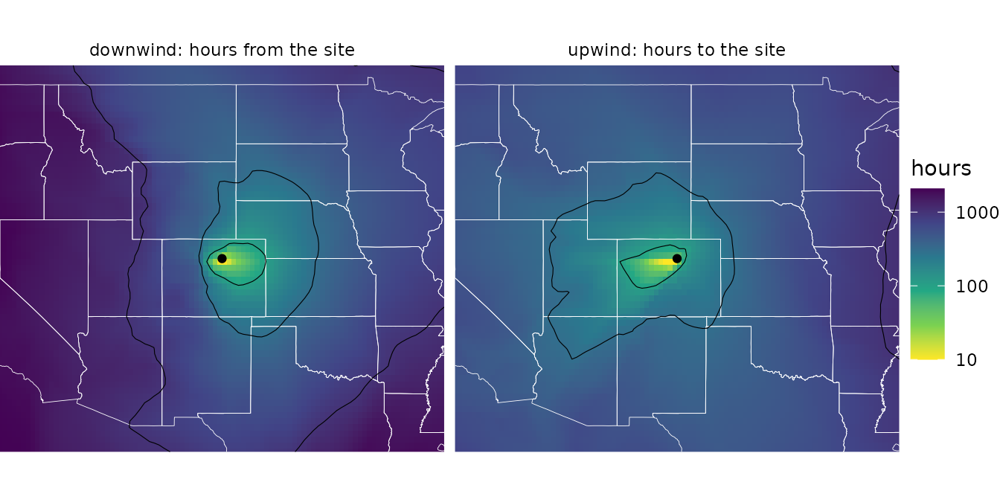
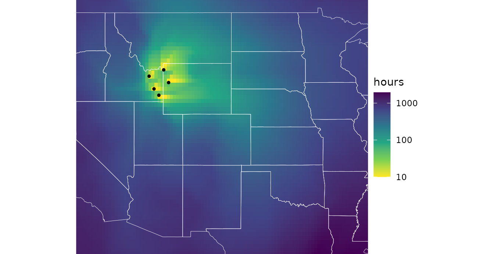
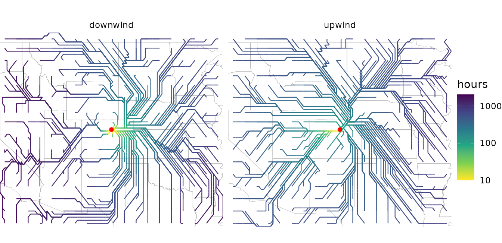
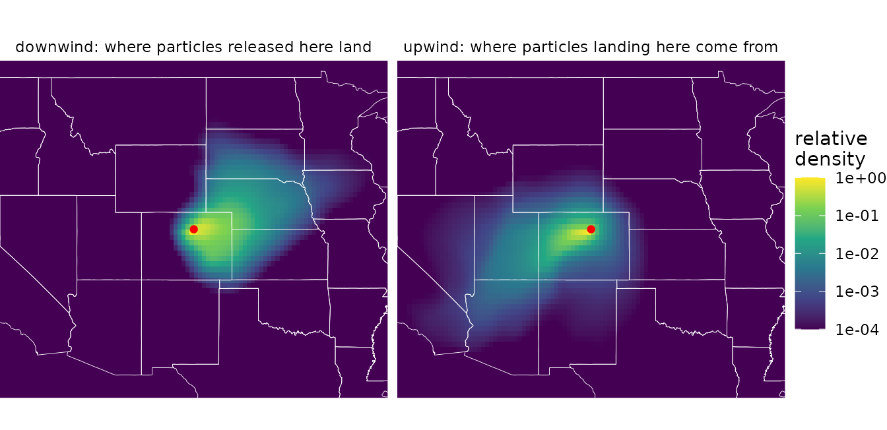
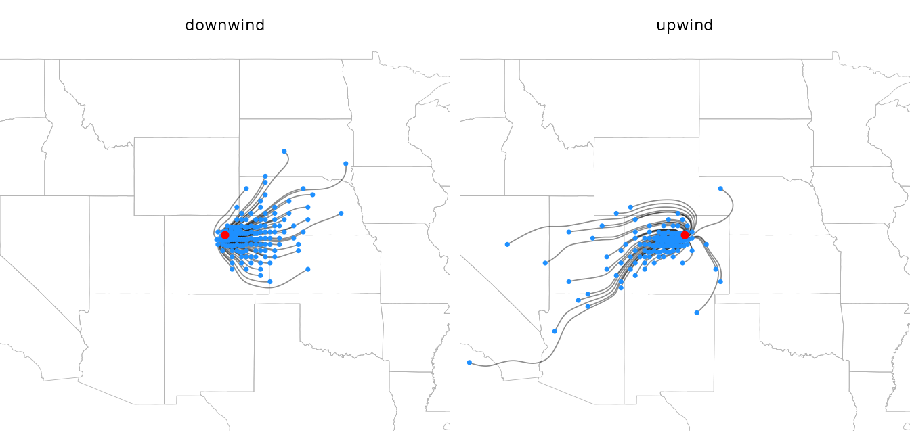
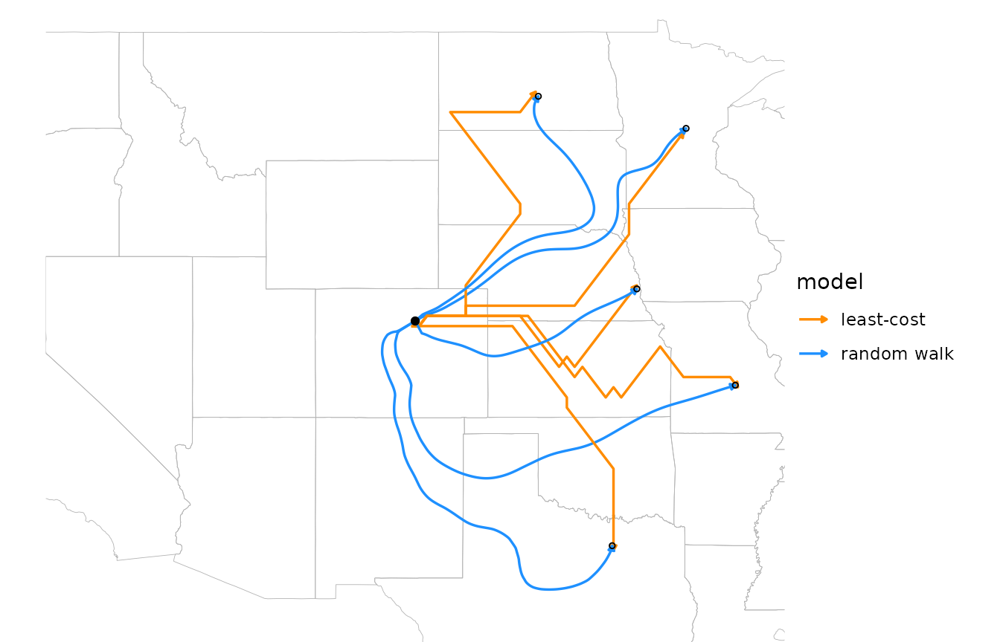
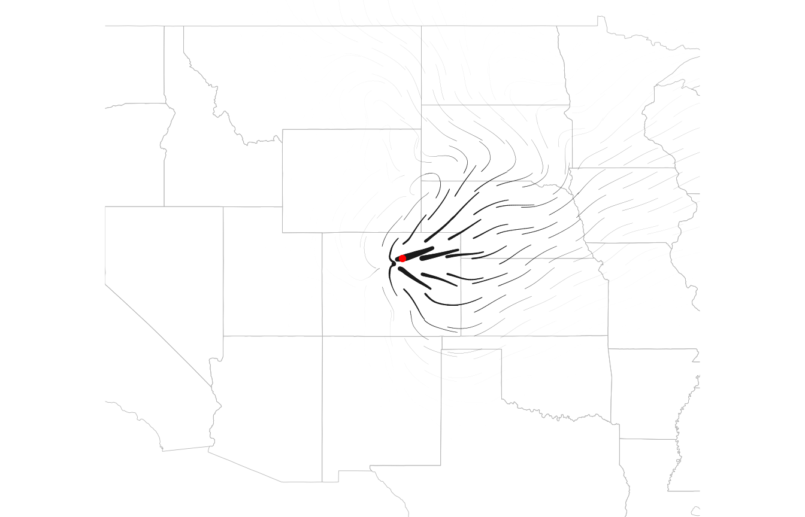

# Windsheds

A watershed is the area that drains to a point on a river. By analogy, a
**windshed** is the area that wind connects to a site. Because wind is
directional, every site has two:

- Its **downwind windshed**: where wind carries material released at the
  site, such as its pollen, seeds, or spores.
- Its **upwind windshed**: where material arriving at the site comes
  from.

The two are usually very different. Under prevailing westerlies, a
site’s downwind windshed stretches to the east and its upwind windshed
to the west, so the places a population can colonize are not the places
its immigrants come from.

This article shows how to map windsheds with both of windscape’s
connectivity models, how to trace the routes that connect a site to its
windshed, and how to summarize windsheds for comparison across sites. It
uses model settings such as `half_life` without explaining them in
depth; the [connectivity
models](https://matthewkling.github.io/windscape/articles/connectivity-models.md)
article covers how the models work and how to choose their settings.

``` r

library(windscape)
library(ggplot2)

rose <- windscape_example("wind_rose")
site <- cbind(-105, 40) # north-central Colorado

states <- map_data("state")
borders <- geom_path(data = states, aes(long, lat, group = group),
                     color = "white", linewidth = 0.15, inherit.aes = FALSE)
us <- coord_quickmap(xlim = c(-120, -90), ylim = c(30, 50), expand = FALSE)
facets <- theme(strip.text = element_text(margin = margin(4, 0, 4, 0)))
```

## Least-cost windsheds

A least-cost windshed maps the fastest wind route between a site and
every place in the landscape.
[`least_cost()`](https://matthewkling.github.io/windscape/reference/least_cost.md)
returns the travel time along that route, in hours (for a rose built
with `trans = 1` from winds in m/s): downwind, from the site to each
cell, and upwind, from each cell to the site.

``` r

down <- least_cost(rose, site, direction = "downwind")
up <- least_cost(rose, site, direction = "upwind")

d <- rbind(data.frame(as.data.frame(down, xy = TRUE), windshed = "downwind: hours from the site"),
           data.frame(as.data.frame(up, xy = TRUE), windshed = "upwind: hours to the site"))

ggplot(d, aes(x, y)) +
      geom_raster(aes(fill = pmax(hours, 10))) + # floor at 10 hours for the log scale
      borders +
      geom_contour(aes(z = hours), breaks = c(100, 300, 1000), color = "black", linewidth = 0.2) +
      annotate("point", site[1], site[2], size = 1.5) +
      facet_wrap(~windshed) +
      scale_fill_viridis_c(name = "hours", trans = "log10", direction = -1) +
      us + theme_void() + facets
```



Travel times are a measure of accessibility, not a prediction of when
particles arrive: each step’s cost is the time to cross it at the
long-run average wind speed in that direction, including the time the
wind spends blowing other ways. Small values mean strong connectivity.
`rate = TRUE` returns the inverse, a flow rate, for analyses where large
values should mean strong connectivity, as they do for random walks.

Given several sites,
[`least_cost()`](https://matthewkling.github.io/windscape/reference/least_cost.md)
maps the travel time to or from the nearest one, for example the
windshed of a whole population or species range, represented by a set of
occurrence points:

``` r

range_pts <- cbind(c(-112, -111, -110.5, -112.5, -111.5), c(43, 44.5, 43.5, 44, 42.5))
down_range <- least_cost(rose, range_pts, direction = "downwind")

ggplot(as.data.frame(down_range, xy = TRUE), aes(x, y)) +
      geom_raster(aes(fill = pmax(hours, 10))) +
      borders +
      annotate("point", range_pts[, 1], range_pts[, 2], size = 1) +
      scale_fill_viridis_c(name = "hours", trans = "log10", direction = -1) +
      us + theme_void()
```



## Least-cost paths

[`least_cost_paths()`](https://matthewkling.github.io/windscape/reference/least_cost_paths.md)
returns the routes behind those travel times, as path data that
[`geom_wind_path()`](https://matthewkling.github.io/windscape/reference/geom_wind_path.md)
draws. By default it traces paths between the site and a regular grid of
about `n` points across the domain, which shows the network of fastest
routes:

``` r

paths <- rbind(
      data.frame(least_cost_paths(rose, site, n = 300, direction = "downwind"), windshed = "downwind"),
      data.frame(least_cost_paths(rose, site, n = 300, direction = "upwind"), windshed = "upwind"))
head(paths)
#>   trail site to step     hours         x        y windshed
#> 1     1    1  1    0   0.00000 -105.1579 39.84127 downwind
#> 2     1    1  1    1  23.30238 -105.4737 39.84127 downwind
#> 3     1    1  1    2  52.75803 -105.7895 39.84127 downwind
#> 4     1    1  1    3 113.33490 -106.1053 39.84127 downwind
#> 5     1    1  1    4 254.08530 -106.4211 39.84127 downwind
#> 6     1    1  1    5 324.87818 -106.7368 40.15873 downwind

# travel time between each vertex and the site: elapsed time on downwind paths, and time
# remaining on upwind paths
paths$from_site <- ifelse(paths$windshed == "downwind", paths$hours,
                          ave(paths$hours, paths$windshed, paths$trail, FUN = max) - paths$hours)

ggplot(paths, aes(x, y)) +
      geom_path(data = states, aes(long, lat, group = group), color = "gray70",
                linewidth = 0.15, inherit.aes = FALSE) +
      geom_wind_path(aes(color = pmax(from_site, 10)), linewidth = 0.4, arrow = NULL) +
      annotate("point", site[1], site[2], color = "red", size = 1.5) +
      facet_wrap(~windshed) +
      scale_color_viridis_c(name = "hours", trans = "log10", direction = -1) +
      us + theme_void() + facets
```



Each row is a vertex of a path, ordered in the direction of travel:
downwind paths start at the site, and upwind paths end there. `hours`
accumulates along each path, and its final value is the travel time
between the pair. Paths move between neighboring cell centers, in eight
directions, so they are built from horizontal, vertical, and diagonal
segments.

The paths from one site form a tree: once two paths meet, they share the
rest of their route to or from the site. Heavily shared branches are the
main corridors of wind transport. (Where two diagonal steps cross
between cell centers, two branches can appear to cross without meeting.)

Paths can also run to or from chosen points, with `to`.
`pairs = "nearest"` traces one path for each site, to or from the point
in `to` with the shortest travel time, and `pairs = "matched"` pairs
`sites` and `to` row by row; see
[`?least_cost_paths`](https://matthewkling.github.io/windscape/reference/least_cost_paths.md).

## Random walk windsheds

A random walk windshed instead follows particles diffusing through the
wind rose along all routes, in proportion to how much wind flows along
each, and depositing as they go. In stream mode,
[`random_walk()`](https://matthewkling.github.io/windscape/reference/random_walk.md)
returns the long-run result of continuous release from the site. Its
`deposition` layer is the downwind windshed: the probability density
(per km^2) that a particle released at the site lands in each cell.

``` r

down <- random_walk(rose, site, mode = "stream", direction = "downwind", half_life = 48)
names(down)
#> [1] "residence"  "deposition"
```

Upwind walks with a finite half-life have two layers that describe the
upwind windshed, and they answer different questions:

- `deposition`: how likely a particle released in each cell is to be
  deposited at the site (by default, as a density per km^2 of the site’s
  cell). This asks, “if particles were released here, would they reach
  the site?”
- `origin`: the share of the particles deposited at the site that come
  from each cell (by default, per km^2). This asks, “of the particles
  reaching the site, what share came from here?”

`origin` is `deposition` weighted by how much each cell releases, and
normalized. By default, every cell releases the same amount per km^2, so
the two maps have the same shape. They differ when release varies, given
as a raster with the `source` argument, such as the abundance of a
species that produces the particles: then `origin` shows where the
site’s immigrants actually come from.

``` r

up <- random_walk(rose, site, mode = "stream", direction = "upwind", half_life = 48)

d <- rbind(data.frame(fortify(down)[c("x", "y")], value = fortify(down)$deposition,
                      windshed = "downwind: where particles released here land"),
           data.frame(fortify(up)[c("x", "y")], value = fortify(up)$origin,
                      windshed = "upwind: where particles landing here come from"))
d$value <- d$value / ave(d$value, d$windshed, FUN = max) # relative to each windshed's peak

ggplot(d, aes(x, y)) +
      geom_raster(aes(fill = value)) +
      borders +
      annotate("point", site[1], site[2], color = "red", size = 1.5) +
      facet_wrap(~windshed) +
      scale_fill_viridis_c(name = "relative\ndensity", trans = "log10",
                           limits = c(1e-4, 1), oob = scales::squish) +
      us + theme_void() + facets
```



These windsheds point the same ways as the least-cost ones, but they
measure something different. A least-cost map gives every place a travel
time, however remote. A random walk map gives the share of the site’s
material that actually gets there, which falls off steeply with distance
as particles are deposited along the way (note the log scale). The
half-life sets the windshed’s reach: short half-lives keep it close to
the site, and long ones extend it across the landscape.

Like
[`least_cost()`](https://matthewkling.github.io/windscape/reference/least_cost.md),
[`random_walk()`](https://matthewkling.github.io/windscape/reference/random_walk.md)
accepts several sites, releasing one unit from each grid cell that
contains a site. For uneven release, such as from a population whose
abundance varies across its range, give `init` as a raster of release
amounts on the rose’s grid:

``` r

abundance <- rose[[1]] * 0 # a raster on the rose's grid
abundance[terra::cellFromXY(abundance, range_pts)] <- c(5, 1, 2, 1, 3)
range_windshed <- random_walk(rose, abundance, mode = "stream", half_life = 48)
```

## Random walk paths

[`random_walk_paths()`](https://matthewkling.github.io/windscape/reference/random_walk_paths.md)
is the random walk counterpart to
[`least_cost_paths()`](https://matthewkling.github.io/windscape/reference/least_cost_paths.md),
and returns path data in a similar layout (`trail`, `step`, `x`, and
`y`), for drawing with
[`geom_wind_path()`](https://matthewkling.github.io/windscape/reference/geom_wind_path.md).
**Despite its name, it involves no randomness.** It doesn’t simulate the
zigzagging paths of individual particles. It traces streamlines of the
walk’s net flux of material: the average routes along which material
moves. Running it twice gives identical results.

Without `to`,
[`random_walk_paths()`](https://matthewkling.github.io/windscape/reference/random_walk_paths.md)
places the ends of `n` paths in proportion to where material is
deposited (or leaves the domain), so each path carries an equal share of
the released material. The density of paths shows where material goes,
and a dot at the end of each path shows where its share lands:

``` r

rw_paths <- rbind(
      data.frame(random_walk_paths(rose, site, n = 150, half_life = 48), windshed = "downwind"),
      data.frame(random_walk_paths(rose, site, n = 150, half_life = 48, direction = "upwind"),
                 windshed = "upwind"))
# where each path's material lands (downwind) or originates (upwind)
id <- paste(rw_paths$windshed, rw_paths$trail)
ends <- rw_paths[ifelse(rw_paths$windshed == "downwind", !duplicated(id, fromLast = TRUE), !duplicated(id)), ]

ggplot(rw_paths, aes(x, y)) +
      geom_path(data = states, aes(long, lat, group = group), color = "gray70",
                linewidth = 0.15, inherit.aes = FALSE) +
      geom_wind_path(alpha = 0.5, linewidth = 0.3, arrow = NULL) +
      geom_point(data = ends, size = 0.6, color = "dodgerblue") +
      annotate("point", site[1], site[2], color = "red", size = 1.5) +
      facet_wrap(~windshed) +
      us + theme_void() + facets
```



Upwind paths start where material originates, placed in proportion to
`origin`, and end at the site. Because most material is deposited close
to where it is released, most paths are short; a larger `n` resolves
more long-distance routes.

## Comparing the two kinds of paths

The two models answer different questions about the route between two
places. A least-cost path is the single fastest route. A random walk
path is the average route of the material that actually makes the trip,
which spreads across all routes. Given the same destinations with `to`,
the difference is easy to see:

``` r

to <- cbind(c(-94, -92, -97, -100, -96), c(46, 38, 33, 47, 41))
both <- rbind(
      data.frame(least_cost_paths(rose, site, to)[c("trail", "step", "x", "y")], model = "least-cost"),
      data.frame(random_walk_paths(rose, site, to = to, half_life = 48), model = "random walk"))

ggplot(both, aes(x, y)) +
      geom_path(data = states, aes(long, lat, group = group), color = "gray70",
                linewidth = 0.15, inherit.aes = FALSE) +
      geom_wind_path(aes(color = model, group = interaction(model, trail)), linewidth = 0.6) +
      annotate("point", site[1], site[2], size = 1.5) +
      annotate("point", to[, 1], to[, 2], size = 1, shape = 1) +
      scale_color_manual(values = c("darkorange", "dodgerblue")) +
      us + theme_void()
```



Least-cost paths are built from grid steps and can zigzag where the
fastest route lies between two neighbor directions. Random walk paths
are smooth, and can depart widely from the fastest route: the material
that reaches the southernmost point travels mostly by way of New Mexico
and Texas, swinging around with the winds there, rather than taking the
most direct fast route.

Paths to chosen points no longer carry equal shares of material, so with
`to`, the density of random walk paths has no meaning. Points the
material doesn’t reach can’t be traced and are dropped with a warning.

## Flux

Paths sample the flow of material at a few places. To map it everywhere,
[`random_walk()`](https://matthewkling.github.io/windscape/reference/random_walk.md)
returns the net flux with `flux = TRUE`: the direction and rate at which
material moves through each cell. It’s a `wind_field`, so the wind field
layers draw it. Flux spans orders of magnitude, from near the site to
the windshed’s fringes, so it’s clearer to show its magnitude as line
width (here on a square-root scale) and draw all trails the same length.
Arrowheads don’t shrink with line width, so they’re left off here;
material flows outward from the site.

``` r

down <- random_walk(rose, site, mode = "stream", half_life = 48, flux = TRUE)

ggplot(down$flux, aes(x, y)) +
      geom_path(data = states, aes(long, lat, group = group), color = "gray70",
                linewidth = 0.15, inherit.aes = FALSE) +
      geom_wind_trail(aes(linewidth = after_stat(speed)), fixed_length = TRUE, res = 25,
                      arrow = NULL, lineend = "round") +
      annotate("point", site[1], site[2], color = "red", size = 1.5) +
      scale_linewidth(trans = "sqrt", range = c(0, 2), guide = "none") +
      us + theme_void()
```



Flux shows the transport that produces a windshed, which its shape alone
doesn’t: across the flanks of a plume, for example, material moves
mostly downwind rather than sideways toward lower density. For an upwind
walk (which requires a finite `half_life`), flux is the transport of the
material that ends up at the site, showing the routes by which it
arrives.

## Comparing windsheds across sites

To compare windsheds among many sites,
[`ws_summarize()`](https://matthewkling.github.io/windscape/reference/ws_summarize.md)
reduces a windshed to summary statistics, including the distance and
bearing from the site to its centroid, and the windshed’s mean bearing
and spread of bearings. It expects large values to mean strong
connectivity, so use `rate = TRUE` for least-cost windsheds:

``` r

ws_summarize(least_cost(rose, site, rate = TRUE), site)[c("centroid_distance", "centroid_bearing")]
#> centroid_distance  centroid_bearing 
#>         152.48696          82.39936
ws_summarize(down$deposition, site)[c("centroid_distance", "centroid_bearing")]
#> centroid_distance  centroid_bearing 
#>         167.76064          86.73836
```

Both windsheds center east of the site. See
[`?ws_summarize`](https://matthewkling.github.io/windscape/reference/ws_summarize.md)
for all the statistics.

## Plotting tips

The maps above convert windsheds to data frames:
`as.data.frame(x, xy = TRUE)` for least-cost rasters, and
[`fortify()`](https://ggplot2.tidyverse.org/reference/fortify.html) for
random walk results. The `geom_spatraster()` layer from the
[tidyterra](https://dieghernan.github.io/tidyterra/) package plots any
`SpatRaster` directly, including a single windshed layer:

``` r

ggplot() +
      tidyterra::geom_spatraster(data = least_cost(rose, site)) +
      scale_fill_viridis_c(trans = "log10")
```

Windsheds span orders of magnitude, so log color scales usually work
best. Least-cost travel times are zero at the site and random walk
densities approach zero far from it, so floor or squish values before
log-transforming, as in the maps above.
