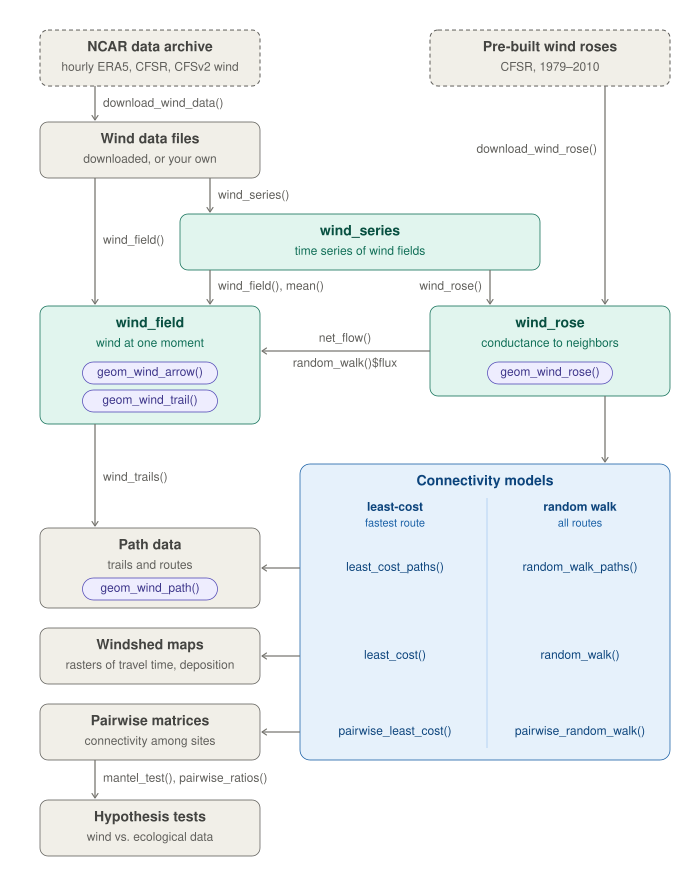

```{r, include = FALSE}
knitr::opts_chunk$set(collapse = TRUE, comment = "#>", message = FALSE, warning = FALSE,
                      fig.width = 7, fig.height = 4.5, out.width = "100%", dpi = 96)
set.seed(1)
```

Wind carries pollen, seeds, spores, insects, pathogens, and pollutants across landscapes. Unlike
most landscape connectivity, wind connectivity is directional: air flows strongly in some
directions and weakly in others, so a site can send much to its downwind neighbors while
receiving little from them. **windscape** models this directional connectivity from time
series of wind conditions, describing the expected connectivity produced by many dispersal
events rather than any single one.

A windscape analysis follows a few steps:

1. **Wind data**: a time series of gridded wind vectors (a `wind_series`).
2. **Wind rose**: a summary of the time series as the average conductance of wind from each grid
   cell toward each of its eight neighbors (a `wind_rose`).
3. **Connectivity model**: either a least-cost model, which finds the fastest routes through the
   wind rose, or a random walk model, which simulates particles diffusing through it.
4. **Analysis**: mapping **windsheds**, the connectivity between a site and the whole landscape,
   or estimating **pairwise connectivity** among a set of sites, for comparison with ecological
   data.

The diagram below maps how windscape's main objects (teal) and functions connect, along with the
ggplot2 layers for drawing each object (purple):

```{r workflow, echo = FALSE, fig.alt = "Diagram of the windscape workflow: wind data become a wind_series, which yields wind fields and a wind rose; the wind rose feeds least-cost and random walk models, which produce path data, windshed maps, and pairwise matrices for hypothesis tests."}

```

This vignette walks through each step using small example data sets that ship with the package.
For more depth, the [package website](https://matthewkling.github.io/windscape/) has articles on
[wind data](https://matthewkling.github.io/windscape/articles/wind-data.html),
[windsheds](https://matthewkling.github.io/windscape/articles/windsheds.html),
[pairwise connectivity](https://matthewkling.github.io/windscape/articles/pairwise-connectivity.html),
and the [connectivity models](https://matthewkling.github.io/windscape/articles/connectivity-models.html).


```{r setup}
library(windscape)
library(ggplot2)

states <- map_data("state")
```


## Wind data

### Wind fields

The basic unit of wind data is a **wind field**: the wind across a grid at a single moment,
stored as two raster layers giving the eastward (`u`) and northward (`v`) components of the wind
vector in each cell. `wind_field()` creates one from a two-layer `SpatRaster`, or from one time
step of a wind time series. Here's the first time step of the example data, for midnight UTC on
January 1, 2000:

```{r field}
series <- windscape_example("wind_series")
field <- wind_field(series, step = 1)

ggplot(field, aes(x, y)) +
      geom_raster(aes(fill = speed)) +
      geom_path(data = states, aes(long, lat, group = group), color = "white", linewidth = 0.2) +
      geom_wind_arrow(color = "white") +
      scale_fill_viridis_c(name = "wind speed\n(m/s)") +
      coord_quickmap(xlim = c(-120, -90), ylim = c(30, 50), expand = FALSE) +
      theme_void()
```

`geom_wind_arrow()` draws wind vectors, and `geom_wind_trail()` draws trails that follow the
airflow. Wind fields are useful for visualizing the wind at a given moment, but windscape's
connectivity models are built from many of them.

### Wind time series

A `wind_series` is a sequence of wind fields stored as a single `SpatRaster`: all the u layers,
followed by all the v layers, in the same time order. The example series covers the western and
central US at about 0.3 degree resolution, with `r series@n_steps` time steps from the year 2000 (every 6 hours
on the 1st and 15th of each month):

```{r series}
series
```

Layer names record each time step. A real analysis would usually use far more data: windscape's
models describe the average behavior of the wind over the time series, and hourly data from
many months or years captures its variability much better. Downsampled or averaged winds (e.g.
monthly means) give poor results, because averaging cancels out winds blowing in opposite
directions. How long a record to use depends on the question: decades for processes like gene
flow that integrate over many generations, or a single season for dispersal during a flowering
or sporulation period.

`download_wind_data()` downloads hourly wind data from NCAR's Geoscience Data Exchange, with no account
needed: ERA5 (1940 to present), CFSR (1979-2010), and CFSv2 (2011 to present). Data are clipped
to a bounding box on the server and saved as one cached file per month, which
`wind_series()` combines into one series:

```{r download, eval = FALSE}
files <- download_wind_data("era5", xlim = c(-120, -90), ylim = c(30, 50),
                       years = 2011:2020, time_stride = 3, dir = "~/wind_data")
series <- wind_series(files)
```

Wind data from other sources can be used too. Load it as a `SpatRaster` on a longitude/latitude
grid, with wind components in m/s, and convert it with `wind_series()`. Its `order` argument
describes how the layers are arranged: `"uuvv"` (all u layers, then all v layers) or `"uvuv"`
(alternating).

```{r own-data, eval = FALSE}
series <- wind_series(terra::rast("my_wind_data.tif"), order = "uvuv")
```


## Wind roses

A **wind rose** summarizes a wind time series into a model of the wind regime. For each time step,
windscape divides the wind in each grid cell between the two neighboring cells whose directions
bracket the wind direction, in proportion to how closely the wind points toward each. It then
averages over all time steps, giving the mean **conductance** of wind from each cell toward each
of its eight neighbors: the rate at which wind moves material from the cell to that neighbor, in
units of 1/hour when wind speeds are in m/s.

```{r rose}
rose <- wind_rose(series, trans = 1)
rose
```

The `trans` argument sets how wind speed translates into conductance. The default, `trans = 1`,
makes conductance proportional to wind speed. Larger powers emphasize strong winds, for example
to model seeds that are only released in strong winds, and a function can be supplied for other
relationships, such as a threshold speed; see `?wind_rose`.

The rest of this vignette uses a wind rose that ships with the package, built from a longer
version of the example time series. `geom_wind_rose()` maps a wind rose as a field of glyphs,
each showing the distribution of flow toward the eight neighbors in a block of grid cells, colored
by the direction of net flow:

```{r rose-map, fig.height = 5}
rose <- windscape_example("wind_rose")

ggplot(rose, aes(x, y)) +
      geom_path(data = states, aes(long, lat, group = group), color = "gray70", linewidth = 0.2) +
      geom_wind_rose(res = 12) +
      coord_quickmap(xlim = c(-120.5, -89.5), ylim = c(29.5, 51), expand = FALSE) +
      theme_void()
```

`net_flow()` reduces a wind rose to a single vector per cell: the net direction and rate at which
the rose moves material, on balance. It returns a wind field, so it can be plotted the same way:

```{r net-flow}
ggplot(net_flow(rose), aes(x, y)) +
      geom_raster(aes(fill = speed)) +
      geom_path(data = states, aes(long, lat, group = group), color = "white", linewidth = 0.2) +
      geom_wind_trail(color = "white", hours = 24) +
      scale_fill_viridis_c(name = "net flow\n(km/h)") +
      coord_quickmap(xlim = c(-120, -90), ylim = c(30, 50), expand = FALSE) +
      theme_void()
```

Two optional steps can adjust a wind rose before modeling. `weight_conductance()` scales
conductance by a raster of weights between 0 and 1, for example to reduce connectivity across
open water for terrestrial organisms (`download_land_mask()` downloads a matching land-water layer).
`downscale()` interpolates the wind rose onto a finer grid. It rarely changes least-cost results,
but it does change random walk results, because a random walk's spread depends on cell size; see
`?downscale` before using it.


## Connectivity models

windscape offers two ways to model connectivity from a wind rose. The [connectivity models](https://matthewkling.github.io/windscape/articles/connectivity-models.html)
article gives more detail on how both models work, what their settings do, and how to 
choose between them.We'll apply both to the same site in north-central Colorado:

```{r site}
site <- cbind(-105, 40)
```

### Least-cost paths

A **least-cost model** treats the wind rose as a network of grid cells, where the cost of moving
from a cell to a neighbor is the inverse of the conductance between them. The least-cost route
between two places is the one with the lowest total cost, and its cost is a travel time, in hours
if the rose was built with `trans = 1` from wind speeds in m/s.

These travel times are best understood as a measure of accessibility by wind. Each step's cost is
the time to cross it at the long-run average wind speed in that direction, which includes zeros for
all the time the wind spends blowing in other directions. A travel time is therefore the time to follow
the best route, including time waiting at a standstill for the wind direction to align roughly with
the direction of travel. Travel times are comparable across places and directions, which is what most
analyses need, but they don't predict when real particles arrive.

`wind_graph()` builds the network, in one of two directions. A `"downwind"` graph measures travel
from the site to other places, and an `"upwind"` graph measures travel from other places to the
site. `least_cost()` maps travel times between a site and every grid cell across the landscape:

```{r least-cost, fig.height = 3.4}
down <- least_cost(rose, site, "downwind")
up <- least_cost(rose, site, "upwind")

d <- rbind(data.frame(as.data.frame(down, xy = TRUE), direction = "downwind: travel time from the site"),
           data.frame(as.data.frame(up, xy = TRUE), direction = "upwind: travel time to the site"))

ggplot(d, aes(x, y)) +
      geom_raster(aes(fill = pmax(hours, 10))) + # floor at 10 hours for the log scale
      geom_path(data = states, aes(long, lat, group = group), color = "white", linewidth = 0.15) +
      geom_contour(aes(z = hours), color = "black", breaks = c(100, 200, 500, 1000), linewidth = 0.15) +
      annotate("point", site[1], site[2], color = "black", size = 1.5) +
      facet_wrap(~direction) +
      scale_fill_gradientn(name = "hours", trans = "log10", values = c(0, .5, .7, .85, 1),
                           colors = c("cyan", "dodgerblue", "purple", "red", "orange")) +
      coord_quickmap(xlim = c(-120, -90), ylim = c(30, 50), expand = FALSE) +
      theme_void() +
      theme(strip.text = element_text(margin = margin(4, 0, 4, 0)))
```

Places to the east are reached quickly from the site, while places to the west are reached
slowly, and the pattern reverses for travel to the site. `least_cost_paths()` returns the routes
themselves, which can be drawn with `geom_wind_trail()`.

### Random walks

A **random walk model** instead simulates particles moving through the wind rose. At each time
step, particles move from each cell to its neighbors at rates set by the conductances, so they
spread along all routes in proportion to how much wind flows along them, rather than only along
the fastest one. Particles are removed from the air at a constant rate, set by a half-life in
hours, and the particles removed from each cell make up its **deposition**.

`random_walk()` has two modes. In `"pulse"` mode, particles are released once and tracked over
time, which shows how a release spreads and drifts. Here are the airborne particles from a
single release after one, three, and seven days, with a half-life of three days, each shown
relative to its peak density (the total airborne mass declines as particles are deposited):

```{r pulse, fig.height = 2.8}
pulse <- random_walk(rose, site, mode = "pulse", half_life = 72,
                     iter = 168, record = c(24, 72, 168))

d <- as.data.frame(pulse$airborne, xy = TRUE)
d <- data.frame(d[c("x", "y")], hours = rep(c(24, 72, 168), each = nrow(d)),
                density = unlist(d[-(1:2)]))
d$hours <- factor(paste(d$hours, "hours"), levels = paste(c(24, 72, 168), "hours"))
d$density <- d$density / ave(d$density, d$hours, FUN = max) # relative to each panel's peak
d$density <- pmax(d$density, 1e-3) # cells the particles haven't reached are exactly zero

ggplot(d, aes(x, y)) +
      geom_raster(aes(fill = density)) +
      geom_path(data = states, aes(long, lat, group = group), color = "white", linewidth = 0.15) +
      annotate("point", site[1], site[2], color = "red", size = 1) +
      facet_wrap(~hours) +
      scale_fill_viridis_c(name = "relative\ndensity", trans = "log10",
                           limits = c(1e-3, NA), oob = scales::squish) +
      coord_quickmap(xlim = c(-120, -90), ylim = c(30, 50), expand = FALSE) +
      theme_void() +
      theme(strip.text = element_text(margin = margin(4, 0, 4, 0)))
```

In `"stream"` mode, particles are released continuously, and the model returns the long-run
steady state: the share of particles airborne over each cell (`residence`), and the share
deposited in each cell (`deposition`). This suits processes that integrate over many releases,
such as seed rain or gene flow. Like least-cost models, random walks can run in either direction.
A downwind walk shows where particles released at the site end up, while an upwind walk shows
where particles deposited at the site came from (its `origin` layer):

```{r stream}
down <- random_walk(rose, site, mode = "stream", direction = "downwind", half_life = 48)
up <- random_walk(rose, site, mode = "stream", direction = "upwind", half_life = 48)
```

The half-life controls how far particles travel: short half-lives keep them close to the source,
while long half-lives let them spread across the landscape, as they would for long-lived
propagules or for gene flow over many generations. With `trans = 1` and winds in m/s, it is in
hours.

## Windsheds

The least cost maps above are **windsheds**: by analogy to a watershed, the area a site's propagules can
reach (its downwind windshed), or the area its arriving propagules come from (its upwind
windshed). Here are the site's random walk windsheds:

```{r windsheds, fig.height = 3.4}
d <- rbind(data.frame(fortify(down)[c("x", "y")], value = fortify(down)$deposition,
                      windshed = "downwind: where particles released here land"),
           data.frame(fortify(up)[c("x", "y")], value = fortify(up)$origin,
                      windshed = "upwind: where particles landing here come from"))
d$value <- d$value / ave(d$value, d$windshed, FUN = max) # relative to each windshed's peak

ggplot(d, aes(x, y)) +
      geom_raster(aes(fill = value)) +
      geom_path(data = states, aes(long, lat, group = group), color = "white", linewidth = 0.15) +
      annotate("point", site[1], site[2], color = "red", size = 1.5) +
      facet_wrap(~windshed) +
      scale_fill_viridis_c(name = "relative\ndensity", trans = "log10",
                           limits = c(1e-4, 1), oob = scales::squish) +
      coord_quickmap(xlim = c(-120, -90), ylim = c(30, 50), expand = FALSE) +
      theme_void() +
      theme(strip.text = element_text(margin = margin(4, 0, 4, 0)))
```

The downwind windshed extends east of the site and the upwind windshed extends to the west,
reflecting the prevailing westerly winds. To compare windsheds across many sites,
`ws_summarize()` reduces a windshed to summary statistics such as its centroid and its mean
bearing from the site.

The [windsheds](https://matthewkling.github.io/windscape/articles/windsheds.html) article covers
windsheds in more depth, including the routes that connect a site to its windshed and the flux of
material through it.


## Pairwise connectivity

For a set of sites, such as sampled populations, `pairwise_least_cost()` and
`pairwise_random_walk()` estimate wind connectivity between every pair, as matrices in which
element `[i, j]` describes flow from site `i` to site `j`. Because wind connectivity is
directional, these matrices are asymmetric (`[j, i]` can differ strongly fom `[i, j]`).

Let's generate ten random sites:

```{r sites}
sites <- cbind(lon = runif(10, -115, -95), lat = runif(10, 33, 47))
```

The two models place sites on the wind grid differently. `pairwise_least_cost()` uses each
site's actual location: it adds the sites to the wind graph and links each one to the centers of
nearby grid cells, and to other sites close by, with exact travel times. It therefore handles
sites that are close together, even within the same grid cell. Least-cost travel times, in hours:

```{r pairwise-lc}
hours <- pairwise_least_cost(wind_graph(rose), sites)
round(hours[1:5, 1:5])
```

A random walk moves particles from cell to cell, so `pairwise_random_walk()` treats each site as
the grid cell it falls in. For sites only a few cells apart, the distances and directions between
cell centers can differ noticeably from those between the sites themselves, and sites in the same
cell get identical results. `check_cell_distance()` reports how much the grid distorts distances
among a set of sites:

```{r check, message = TRUE}
check_cell_distance(rose, sites)
```

None of these sites share a grid cell, and most distance discrepancies are under 2.5 percent,
so this grid works for them. Where many pairs are affected, a finer grid, from finer wind data or
from `downscale()`, separates nearby sites. But a random walk's spread depends on cell size, so
changing the resolution changes the model as well as the grid; see `?downscale`.

Random walk deposition, the density of particles released at each site that are deposited at
each other site:

```{r pairwise-rw}
deposition <- pairwise_random_walk(rose, sites, half_life = 48)
signif(deposition[1:5, 1:5], 2)
```

The diagonal of the deposition matrix is each site's self-retention: the density of its own
release deposited in its own grid cell. It is usually much larger than the other values, but
the tests below ignore diagonals.

### Testing hypotheses

Pairwise wind connectivity can be compared with pairwise ecological data, such as genetic
differentiation or gene flow, to test whether wind shapes ecological patterns. windscape provides
tools for testing several kinds of hypotheses (see Kling and Ackerly 2021 for examples):

- **Flow**: is directional wind connectivity related to directional ecological flow, such as
  gene flow? Compare the matrices directly.
- **Isolation**: are sites with weaker wind connectivity in both directions more differentiated, for
  example genetically? `pairwise_means()` converts an asymmetric matrix into a symmetric one by
  averaging the two directions.
- **Asymmetry**: are directional imbalances in wind connectivity related to imbalances in ecological 
  flow? `pairwise_ratios()` converts a matrix into log ratios of the two directions.

`mantel_test()` tests these relationships with Mantel tests, which assess significance by
permutation since the values in a pairwise matrix aren't independent. Unlike most Mantel
implementations, it handles asymmetric matrices and multiple control variables. Here we run each
test against simulated random data, using geographic distance as a control variable for the flow
and isolation tests:

```{r mantel}
set.seed(1)
distance <- point_distance(sites)
gene_flow <- matrix(runif(100), 10) # simulated gene flow
gene_diff <- pairwise_means(matrix(runif(100), 10)) # simulated genetic differentiation

flow <- mantel_test(deposition, gene_flow, z = list(distance))
isolation <- mantel_test(pairwise_means(hours), gene_diff, z = list(distance))
asymmetry <- mantel_test(pairwise_ratios(hours), pairwise_ratios(gene_flow))

sapply(list(flow = flow, isolation = isolation, asymmetry = asymmetry),
       function(x) round(c(stat = x$stat, p.value = x$p.value), 3))
```

As expected for random data, none of the relationships here are significant. With only ten sites,
these tests also have little power; real analyses often need more sites.

The [pairwise connectivity](https://matthewkling.github.io/windscape/articles/pairwise-connectivity.html)
article compares the two models' matrices, covers site placement in more detail, and works through
these tests with the `birch` landscape genetic data set.


## Learn more

The [package website](https://matthewkling.github.io/windscape/) has articles on each part of the
workflow in more depth:

- [**Wind data**](https://matthewkling.github.io/windscape/articles/wind-data.html): choosing,
  downloading, and preparing wind data, and building wind roses from long records.
- [**Windsheds**](https://matthewkling.github.io/windscape/articles/windsheds.html): mapping and
  comparing site-to-landscape connectivity with least-cost and random walk models.
- [**Pairwise connectivity**](https://matthewkling.github.io/windscape/articles/pairwise-connectivity.html):
  estimating connectivity among sites and testing hypotheses about the role of wind in
  ecological patterns.
- [**Connectivity models in depth**](https://matthewkling.github.io/windscape/articles/connectivity-models.html):
  how least-cost and random walk models work, their settings and limitations, and how to choose
  between them.

windscape implements and extends methods introduced in:

- Kling, M. M., and D. D. Ackerly. 2020. Global wind patterns and the vulnerability of
  wind-dispersed species to climate change. *Nature Climate Change* 10: 868-875.
- Kling, M. M., and D. D. Ackerly. 2021. Global wind patterns shape genetic differentiation,
  asymmetric gene flow, and genetic diversity in trees. *Proceedings of the National Academy of
  Sciences* 118: e2017317118.
